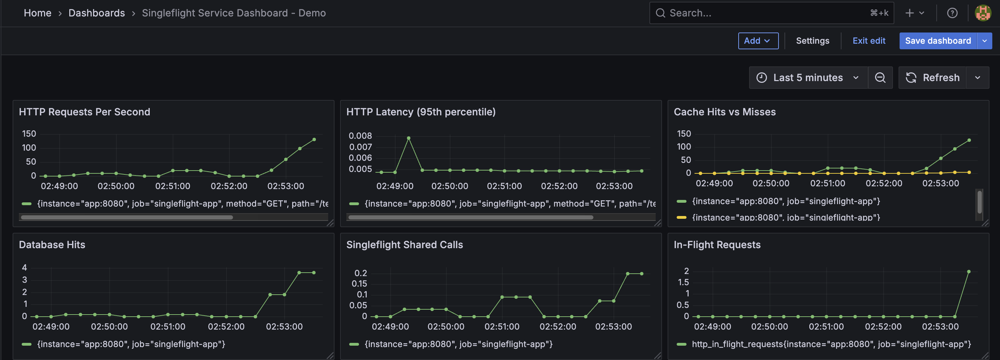

# Singleflight in Go: A Clean Solution to Cache Stampede

Cache stampede is a common problem in distributed systems, especially when the system is under heavy traffic. It happens when a cached value expires (or is missing), and many users request the same data at the same time. Since the cache no longer has the data, all those requests go directly to the backend service or database. This can overload the backend because it has to handle many identical requests simultaneously.

In Go, the `singleflight` package (from `golang.org/x/sync`) helps solve this problem in a simple way. It makes sure that when multiple requests ask for the same data at the same time, only one actual backend call is made. The other requests wait and receive the same result once that single call finishes. This prevents duplicate work and protects the backend from being overwhelmed.

## Cache Stampede

A cache stampede happens when a cached item expires or is removed, and many users request the same data at the same time. Because the data is no longer in the cache, every request goes to the backend service or database instead. This creates a sudden spike in traffic to the backend. If too many requests arrive at once, it can slow down the system or even cause it to crash.

## A Real-World Scenario

In a real production system, a service running inside a Kubernetes pod used Redis as a distributed cache. The service had an endpoint called `/template-details` that returned template information based on a template ID from each request.

Because templates were updated frequently (about every 30 seconds), caching was very important. It helped reduce the number of direct queries sent to the MySQL database.

During a high-traffic period, a network issue happened between the pod and the Redis server. The service could no longer access Redis, so every request resulted in a cache miss. Instead of reading from the cache, the service had to query the MySQL database for every single request.

This caused a sudden and massive increase in database traffic. Since the database was a single point of failure, it quickly became overloaded and temporarily went down. As a result, the entire system became unavailable.

## The Solution - singleflight

To help prevent this kind of cascading failure, Go provides the `singleflight` package in the `golang.org/x/sync` module. This package makes sure that when multiple requests ask for the same data at the same time, only one real request is sent to the backend. The other requests simply wait and receive the same result once that single request finishes.

This simple but powerful approach can greatly reduce pressure on the backend and help avoid system outages caused by cache stampedes.

However, like any solution, `singleflight` also has trade-offs and things you need to consider before using it.

## Architecture

```
Client Request
      |
      v
 [HTTP Handler]  -->  metrics: request count, latency, in-flight
      |
      v
 [TemplateService]
      |
      +--> [Redis Cache] -- HIT  --> return cached value
      |
      +--> [singleflight.Group.Do(key)]  -- deduplicates concurrent calls
                  |
                  v
             [PostgreSQL]  --> fetch from DB, populate cache (TTL 30s)
```

## Project Structure

```
singleflight/
├── cmd/api/main.go                 # Application entrypoint
├── internal/
│   ├── handler/http.go             # HTTP handler with metrics middleware
│   ├── service/template_service.go # Business logic with singleflight + cache-aside
│   ├── cache/redis.go              # Redis cache client
│   ├── repository/postgres.go      # PostgreSQL repository
│   └── metrics/metrics.go          # Prometheus metric definitions
├── migrations/001_init.sql         # Database schema and seed data
├── grafana/
│   ├── dashboards/                 # Pre-built Grafana dashboard
│   └── provisioning/               # Datasource and dashboard provisioning
├── prometheus.yaml                 # Prometheus scrape configuration
├── docker-compose.yaml             # Full stack: app, postgres, redis, prometheus, grafana
├── Dockerfile                      # Multi-stage Go build
└── loadtest.sh                     # Load test script
```

## How It Works

The core logic lives in `TemplateService.GetTemplate()`:

1. **Cache lookup** -- try Redis first. On a hit, return immediately.
2. **Cache miss** -- if Redis returns `redis.Nil`, proceed to the database.
3. **Singleflight deduplication** -- `singleflight.Group.Do(key, fn)` ensures that if multiple goroutines request the same key concurrently, only **one** executes the database query. All others block and receive the same result.
4. **Cache population** -- after the DB query succeeds, the result is stored in Redis with a 30-second TTL.

```go
// Simplified flow
val, err := s.cache.Get(ctx, key)
if err == nil {
    return val, nil // cache hit
}

result, err, shared := s.group.Do(key, func() (interface{}, error) {
    val, err := s.repo.GetByID(ctx, id)  // only ONE goroutine executes this
    s.cache.Set(ctx, key, val, 30*time.Second)
    return val, nil
})
// `shared` is true if this result was shared with other callers
```

## Getting Started

### Prerequisites

- Docker and Docker Compose

### Run

```bash
docker compose up --build -d
```

This starts five services:

| Service    | Port  | Description                  |
|------------|-------|------------------------------|
| app        | 8080  | Go singleflight service      |
| postgres   | 5432  | PostgreSQL database          |
| redis      | 6379  | Redis cache                  |
| prometheus | 9090  | Metrics scraping (every 5s)  |
| grafana    | 3000  | Dashboard (admin/admin)      |

### Test

```bash
# Single request
curl "http://localhost:8080/template-details?id=1"

# Load test (200 concurrent x 25 waves = 5,000+ requests)
./loadtest.sh
```

### Verify Metrics

```bash
curl -s http://localhost:8080/metrics | grep -E "^(http_request_total|cache_|db_hits|singleflight)"
```

## Monitoring

The project includes a pre-configured Grafana dashboard with six panels:

| Panel                        | Metric                           | Description                                    |
|------------------------------|----------------------------------|------------------------------------------------|
| HTTP Requests Per Second     | `http_request_total`             | Request rate by path, method, status           |
| HTTP Latency (95th pctl)     | `http_request_duration_seconds`  | P95 response time                              |
| Cache Hits vs Misses         | `cache_hits_total` / `cache_misses_total` | Cache effectiveness over time         |
| Database Hits                | `db_hits_total`                  | Actual database queries (should be minimal)    |
| Singleflight Shared Calls   | `singleflight_shared_total`     | Responses shared across concurrent callers     |
| In-Flight Requests           | `http_in_flight_requests`        | Current concurrent requests being processed    |

Open Grafana at [http://localhost:3000](http://localhost:3000) (admin/admin), navigate to the **Singleflight Service Dashboard**, and set the time range to **Last 5 minutes**.



## Load Test Results

Running `./loadtest.sh` with 200 concurrent requests across 25 waves (5,000+ total):

| Metric | Value | Insight |
|--------|-------|---------|
| Total requests | ~7,500 | Including spread requests |
| Cache hit rate | ~97% | Most requests served from Redis |
| DB queries | ~220 | Only ~3% actually hit the database |
| Singleflight shared | ~18 | Concurrent calls deduplicated |

The singleflight pattern reduced database load by **~97%**, preventing the cache stampede that would otherwise overwhelm PostgreSQL.

## Trade-offs

- **Increased latency for waiting callers** -- goroutines that "share" a singleflight result must wait for the single in-flight call to complete, rather than failing fast.
- **Single point of failure per key** -- if the one in-flight call fails, all waiting callers receive the same error.
- **Memory pressure under high cardinality** -- each unique key being deduplicated holds waiters in memory until the call completes.

For most read-heavy services with a bounded set of cache keys, these trade-offs are well worth the protection against cache stampedes.